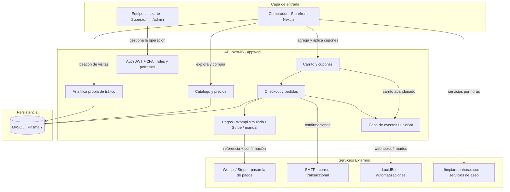

# Limpiarte E-commerce × Limpiarte SAS

Monorepo de la plataforma de comercio electrónico de Limpiarte SAS: tienda en línea de productos de aseo con pago 100% digital, panel de administración (Superadmin) con roles y permisos, e integración por eventos con LucidBot. Backend en NestJS 11 (TypeScript) con Prisma 7 sobre MySQL, frontend en Next.js 16 con Tailwind CSS 4, desplegado en Hostinger con base de datos vía `DATABASE_URL`. El objetivo de negocio es habilitar un canal de venta propio 24/7 para la línea de productos, independiente de los servicios de aseo por horas que continúan en limpiarteenhoras.com.

---

## 🗺️ Arquitectura de la Experiencia

El comprador navega el catálogo, arma su carrito y paga en línea; el equipo de Limpiarte opera todo (catálogo, pedidos, clientes, contenido y automatizaciones) desde el Superadmin, y cada evento del negocio se publica hacia LucidBot para disparar automatizaciones conversacionales.



---

## 🔍 En qué consiste el Fullstack

Monorepo pnpm con dos aplicaciones desacopladas: `apps/api` (REST API NestJS con prefijo `/api/v1`, Swagger en `/docs`) y `apps/web` (Next.js App Router que sirve el storefront público y el Superadmin en `/admin`). El modelo de datos vive en `apps/api/prisma/schema.prisma` (~45 modelos) con cliente Prisma generado en `src/generated/prisma`.

### 📄 Módulos Principales

1. **Catálogo (`apps/api/src/modules/catalog/`)**:
   - CRUD completo de productos con variantes (opciones/combinaciones), imágenes, ficha técnica, FAQs, relaciones (venta cruzada), etiquetas y SEO; categorías jerárquicas y marcas; carga masiva por CSV.
   - Endpoints públicos con búsqueda, filtros combinables (categoría, marca, precio, stock, promoción), ordenamiento y precios efectivos (promos con vigencia y listas de precio) resueltos por `pricing.service.ts`.

2. **Carrito y Checkout (`apps/api/src/modules/cart/`, `orders/`)**:
   - Carrito persistente por token de sesión y fusión automática al iniciar sesión; cupones con restricciones y validación de vigencia/usos; estimador de envío por zona.
   - **Interfaz optimista**: el contador sube al instante y la imagen del producto vuela hasta el carrito (Web Animations API); las respuestas fuera de orden se descartan por secuencia. Del lado del servidor las mutaciones construyen la vista desde memoria en vez de recargar el carrito, lo que bajó el tiempo del endpoint de 4,7 s a ~1 s.
   - **Checkout de tres pasos** (entrega → envío → pago) con resumen de compra fijo: exige sesión de cliente (validado también en el backend, `POST /checkout` devuelve 401 sin token), permite elegir entre direcciones guardadas o fijar una nueva en un **mapa Leaflet/OpenStreetMap** que guarda coordenadas en la dirección y en el pedido.
   - Cálculo de envío por zonas con umbral de envío gratis, facturación empresarial (NIT), snapshot de ítems, numeración `LP-AAAAMMDD-XXXXXX` y máquina de estados del pedido con historial auditado.

3. **Pagos (`apps/api/src/modules/payments/`)**:
   - Abstracción `PaymentGateway` con **Wompi** como pasarela principal en **modo simulado**: página de pago de prueba con PSE/Nequi/tarjeta y aprobación o rechazo controlados. La simulación exige que no haya llave privada y que el entorno no sea producción (en producción se activa solo con `WOMPI_SIMULATION=true`); si no aplica, el pago cae a Stripe o al flujo manual, nunca a una pasarela sin cobro. Stripe queda como alternativa y existe fallback manual.
   - Al confirmarse el pago: descuento automático de inventario con movimientos trazables, redención de cupón, correo de confirmación y eventos `PAYMENT_APPROVED`/`ORDER_STATUS_CHANGED`.

4. **Conversión y prueba social (`apps/api/src/modules/catalog/engagement.service.ts`, `apps/web/components/store/`)**:
   - Reseñas verificadas por compra y preguntas públicas con moderación en el panel; alertas "avísame cuando llegue" con correo automático al reponer; boletín con captura vía popup de bienvenida.
   - Badges reales en tarjeta (−% OFF, más vendido por ventas de 30 días, nuevo, últimas unidades), rating con estrellas, favoritos, drawer de carrito con complementarios, barra de progreso de envío gratis, autocompletado del buscador, order bump en checkout y feed XML para Google Merchant.

5. **Superadmin (`apps/web/app/admin/`)**:
   - **Tablero como central de métricas**: un solo filtro (rango de fechas con presets o personalizado + segmentos por ciudad, categoría, marca y canal) gobierna todos los indicadores, y cada uno muestra su variación contra el período anterior equivalente.
   - Ventas: ingresos, compras, ticket promedio, unidades, evolución diaria comparada, rankings por producto, categoría y ciudad, pedidos por estado.
   - Tráfico web con **analítica propia** (sin Google Analytics ni terceros): visitantes únicos, sesiones, páginas vistas, conversión real sobre sesiones, origen del tráfico (directo, orgánico, social, referido, campañas UTM), páginas más visitadas, productos más vistos y dispositivos.
   - Clientes: nuevos, recurrentes, carritos abandonados y valor potencial. Alertas operativas de despacho, pagos rechazados e inventario bajo.
   - Gestión de productos (formulario completo con generador de variantes), pedidos (estados, guía y transportadora, notas internas, reenvío de correos, exportación CSV), clientes/CRM con etiquetas y exportación, cupones, contenido (banners, páginas legales, blog, menús), zonas de envío, usuarios/roles y auditoría.
   - **Subida de imágenes propia**: cada campo de imagen acepta archivo o URL externa. Los archivos se guardan en el disco del API (`apps/api/uploads/`, servido en `/uploads`) con validación de formato y de magic bytes, límite de 5 MB y nombres aleatorios; en productos se pueden subir varias a la vez.

6. **Usuarios, roles y permisos (`apps/api/src/modules/users/`, `roles/`, `common/guards/`)**:
   - Login administrativo con contraseña + segundo factor por correo, bloqueo por intentos fallidos y cierre de sesión por expiración de JWT.
   - RBAC con 14 permisos y 6 roles sembrados (Administrador, Gestor de catálogo, Gestor de pedidos, Servicio al cliente, Marketing, Auditor), overrides por usuario, tope de 15 usuarios internos activos y Superadmin único.

7. **Integración LucidBot (`apps/api/src/modules/lucidbot/`)**:
   - Conexión asistida desde el Superadmin (URL de webhook + clave cifrada AES-256-GCM, prueba de conectividad, indicador de estado) sin intervención técnica.
   - 9 eventos activables individualmente (carrito abandonado con temporizador, pedido creado, pago aprobado/rechazado, cambios de estado, despacho, entrega, cliente registrado, solicitud de contacto), log histórico con reintentos automáticos cada 10 minutos.

### 🧩 Servicios Destacados

* **`apps/api/src/common/guards/auth.guard.ts`**: guard global que resuelve el principal (staff o cliente) desde el JWT y calcula el set de permisos efectivos (rol + overrides) en cada petición.
* **`apps/api/src/modules/catalog/pricing.service.ts`**: única fuente de verdad del precio efectivo (base, variante, promoción con ventana, listas de precio por volumen); lo consumen catálogo, carrito y checkout.
* **`apps/api/src/modules/orders/orders.service.ts`**: orquesta el ciclo de vida del pedido (transiciones válidas, inventario, cupones, correos y eventos LucidBot) en transacciones Prisma.
* **`apps/api/src/modules/mail/mail.service.ts`**: correo transaccional vía SMTP con plantillas editables desde el Superadmin y variables `{{placeholder}}`.
* **`apps/api/prisma/seed.ts`**: siembra permisos, roles del contrato, cuenta Superadmin, eventos LucidBot y settings base.
* **`apps/web/lib/cart/cart-context.tsx`**: estado global del carrito en el storefront con token persistido en `localStorage` y fusión invitado → cliente.

---

## ⚡ Por qué es Necesario

Hoy la venta de productos de Limpiarte depende de canales conversacionales y gestión manual; no existe un canal transaccional propio donde el cliente pague en línea sin intermediación.

1. **Canal de venta autónomo 24/7**: el cliente explora, compara, agrega al carrito y paga sin intervención del equipo comercial.
2. **Operación centralizada**: catálogo, inventario, pedidos, despachos, clientes y contenido se administran desde un único panel sin depender del desarrollador.
3. **Automatización del embudo**: cada evento (carrito abandonado, pago, despacho, entrega) llega a LucidBot para recuperación de ventas, notificaciones y campañas de recompra.

---

## 💎 Qué aporta a Limpiarte SAS (Valor Agregado)

* **Reducción de carga operativa**: la selección, el pago y el seguimiento de pedidos pasan del chat a la plataforma; el equipo solo prepara y despacha.
* **Autonomía total del negocio**: precios, promociones con vigencia, cupones, banners y textos legales se editan desde el Superadmin sin tocar código.
* **Trazabilidad y control**: bitácora de auditoría de acciones críticas, historial de estados por pedido, movimientos de inventario con motivo y responsable, y roles con mínimo privilegio.
* **Base escalable**: arquitectura desacoplada (API + web), modelo normalizado con migraciones versionadas y pasarela de pagos intercambiable — crece en referencias y volumen sin rediseño.
* **Cumplimiento Ley 1581 de 2012**: registro de consentimiento de términos y tratamiento de datos por cliente, consultable desde el CRM.

---

## 🛠️ Stack y Comandos

- **NestJS 11** (API REST, TypeScript estricto) · **Next.js 16** + **React 19** (storefront y Superadmin) · **Tailwind CSS 4** (estilos) · **Prisma 7** + `@prisma/adapter-mariadb` (MySQL vía `DATABASE_URL`) · **Wompi** (pasarela simulada) y **Stripe 22** (alternativa) · **Nodemailer** (SMTP transaccional) · **Leaflet** (mapa de entrega) · **pnpm 11** workspaces (Node ≥ 22).

```bash
pnpm install                                 # instalar dependencias del monorepo
cp apps/api/.env.example apps/api/.env       # configurar backend
cp apps/web/.env.example apps/web/.env.local # configurar frontend (URL de la API)

pnpm db:generate                             # generar el cliente Prisma (obligatorio: está gitignored)
pnpm --filter @limpiarte/api exec prisma db push   # sincronizar schema
pnpm db:seed                                 # sembrar roles, permisos, Superadmin y settings base

pnpm dev                                     # api (4000) + web (3000) en paralelo
pnpm dev:api                                 # solo API · Swagger en http://localhost:4000/docs
pnpm dev:web                                 # solo web · http://localhost:3000 · Superadmin en /admin

pnpm build                                   # build de producción de api y web
pnpm start:api                               # servir API compilada (dist/main.js)
pnpm start:web                               # servir web compilada
pnpm lint                                    # verificación de tipos en ambos paquetes
```

### 🚀 Despliegue en Hostinger

**Secuencia de build** (el auto-deploy debe ejecutar esto en orden):

```bash
pnpm install --frozen-lockfile
pnpm db:generate      # el cliente Prisma NO está en el repo: sin esto el build falla
pnpm build            # compila API (dist/) y web (.next/)
```

**Arranque**: `pnpm start:api` para la API y `pnpm start:web` para el storefront. Ambos respetan la variable `PORT` que inyecta el hosting (`next start` sin `-p` la toma automáticamente; forzar `-p 3000` deja la app inalcanzable).

> **`NEXT_PUBLIC_API_URL` se resuelve en tiempo de build, no de ejecución.** Next.js reemplaza las variables `NEXT_PUBLIC_*` dentro del bundle durante `next build`, así que definirla solo como variable de entorno del proceso no sirve: tiene que estar presente cuando corre el build, o el navegador seguirá apuntando a `http://localhost:4000/api/v1`.

> **El monorepo tiene dos aplicaciones.** El hosting de Node.js sirve un proceso por sitio, así que la API y el storefront necesitan sitios (o subdominios) separados: por ejemplo `api.dominio.com` ejecutando `pnpm start:api` y `dominio.com` ejecutando `pnpm start:web`, con `CORS_ORIGINS` y `NEXT_PUBLIC_API_URL` apuntando el uno al otro.

> **No usar `pnpm db:deploy`**: el proyecto no tiene carpeta `prisma/migrations` porque el hosting compartido no permite la shadow database que exige `migrate dev`. Los cambios de schema se aplican con `prisma db push` desde una máquina con acceso remoto a la base, nunca en el paso de build.

**Variables obligatorias en el panel de Hostinger.** Con `NODE_ENV=production` la API **no arranca** si falta alguna, si conserva un valor de ejemplo o si los secretos tienen menos de 32 caracteres (validación en `assertProductionEnv`, en `main.ts`):

| Variable | Nota |
|---|---|
| `NODE_ENV` | `production` — apaga Swagger, deja de registrar el código 2FA y bloquea la pasarela simulada |
| `DATABASE_URL` | MySQL de Hostinger |
| `JWT_SECRET` | mínimo 32 caracteres aleatorios; con el valor de ejemplo cualquiera podría firmar tokens de administrador |
| `ENCRYPTION_KEY` | mínimo 32 caracteres; cifra las credenciales del webhook de LucidBot (AES-256-GCM) |
| `CORS_ORIGINS` | dominio del storefront; sin esto el navegador bloquea las peticiones |
| `PUBLIC_BASE_URL` | dominio público de la API — **definirlo antes de subir imágenes**, porque las URLs se guardan absolutas |
| `STOREFRONT_URL` | usado en los correos de alerta de reposición |
| `NEXT_PUBLIC_API_URL` | en el proyecto web: `https://tu-dominio/api/v1` |

Recomendadas: `SMTP_*` y `MAIL_FROM_*` (sin SMTP no salen correos ni el código 2FA del panel), `SUPERADMIN_EMAIL`/`SUPERADMIN_PASSWORD` antes de sembrar, y `UPLOADS_DIR` apuntando a un volumen persistente.

**Tres cosas que hay que tener presentes al pasar a producción:**

1. **Pasarela de pago.** `WompiGateway` opera solo simulado y en producción se desactiva sola, así que el checkout cae al flujo manual (transferencia) hasta que se implemente Wompi real o se configure `PAYMENT_GATEWAY=stripe`. Activar la simulación en producción exige poner `WOMPI_SIMULATION=true` de forma explícita.
2. **Imágenes subidas.** Viven en el disco (`apps/api/uploads/`), no en un CDN, y esa carpeta **sí se versiona**, así que las imágenes actuales llegan a producción con el despliegue. Ojo: las URLs se guardan absolutas, por lo que hay que definir `PUBLIC_BASE_URL` y actualizar las URLs ya guardadas para que apunten al dominio real. Si el hosting recicla el contenedor o escala a varias instancias, montar `UPLOADS_DIR` en un volumen persistente compartido.
3. **Acceso remoto a MySQL.** Para trabajar en local hay que autorizar la IP pública en *MySQL remoto* del panel de Hostinger. En producción no aplica, porque la API y la base conviven en el mismo servidor.
