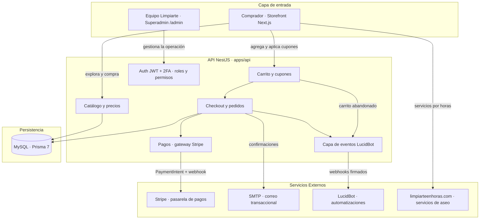

# Limpiarte E-commerce × Limpiarte SAS

Monorepo de la plataforma de comercio electrónico de Limpiarte SAS: tienda en línea de productos de aseo con pago 100% digital, panel de administración (Superadmin) con roles y permisos, e integración por eventos con LucidBot. Backend en NestJS 11 (TypeScript) con Prisma 7 sobre MySQL, frontend en Next.js 16 con Tailwind CSS 4, desplegado en Hostinger con base de datos vía `DATABASE_URL`. El objetivo de negocio es habilitar un canal de venta propio 24/7 para la línea de productos, independiente de los servicios de aseo por horas que continúan en limpiarteenhoras.com.

---

## 🗺️ Arquitectura de la Experiencia

El comprador navega el catálogo, arma su carrito y paga en línea; el equipo de Limpiarte opera todo (catálogo, pedidos, clientes, contenido y automatizaciones) desde el Superadmin, y cada evento del negocio se publica hacia LucidBot para disparar automatizaciones conversacionales.



---

## 🔍 En qué consiste el Fullstack

Monorepo pnpm con dos aplicaciones desacopladas: `apps/api` (REST API NestJS con prefijo `/api/v1`, Swagger en `/docs`) y `apps/web` (Next.js App Router que sirve el storefront público y el Superadmin en `/admin`). El modelo de datos vive en `apps/api/prisma/schema.prisma` (~45 modelos) con cliente Prisma generado en `src/generated/prisma`.

### 📄 Módulos Principales

1. **Catálogo (`apps/api/src/modules/catalog/`)**:
   - CRUD completo de productos con variantes (opciones/combinaciones), imágenes, ficha técnica, FAQs, relaciones (venta cruzada), etiquetas y SEO; categorías jerárquicas y marcas; carga masiva por CSV.
   - Endpoints públicos con búsqueda, filtros combinables (categoría, marca, precio, stock, promoción), ordenamiento y precios efectivos (promos con vigencia y listas de precio) resueltos por `pricing.service.ts`.

2. **Carrito y Checkout (`apps/api/src/modules/cart/`, `orders/`)**:
   - Carrito persistente por token de sesión para invitados y fusión automática al iniciar sesión; cupones con restricciones y validación de vigencia/usos; estimador de envío por zona.
   - Checkout invitado o con cuenta, cálculo de envío por zonas con umbral de envío gratis, facturación empresarial (NIT), snapshot de ítems, numeración `LP-AAAAMMDD-XXXXXX` y máquina de estados del pedido con historial auditado.

3. **Pagos (`apps/api/src/modules/payments/`, `orders/payments-webhook.controller.ts`)**:
   - Abstracción `PaymentGateway` con implementación Stripe (PaymentIntent + webhook firmado); fallback a pago manual si la pasarela no está configurada.
   - Al confirmarse el pago: descuento automático de inventario con movimientos trazables, redención de cupón, correo de confirmación y eventos `PAYMENT_APPROVED`/`ORDER_STATUS_CHANGED`.

4. **Superadmin (`apps/web/app/admin/`)**:
   - Tablero con ventas (hoy/semana/mes), ticket promedio, conversión, serie de 30 días, rankings por producto/categoría/ciudad, carritos abandonados y alertas operativas.
   - Gestión de productos (formulario completo con generador de variantes), pedidos (estados, guía y transportadora, notas internas, reenvío de correos, exportación CSV), clientes/CRM con etiquetas y exportación, cupones, contenido (banners, páginas legales, blog, menús), zonas de envío, usuarios/roles y auditoría.

5. **Usuarios, roles y permisos (`apps/api/src/modules/users/`, `roles/`, `common/guards/`)**:
   - Login administrativo con contraseña + segundo factor por correo, bloqueo por intentos fallidos y cierre de sesión por expiración de JWT.
   - RBAC con 14 permisos y 6 roles sembrados (Administrador, Gestor de catálogo, Gestor de pedidos, Servicio al cliente, Marketing, Auditor), overrides por usuario, tope de 15 usuarios internos activos y Superadmin único.

6. **Integración LucidBot (`apps/api/src/modules/lucidbot/`)**:
   - Conexión asistida desde el Superadmin (URL de webhook + clave cifrada AES-256-GCM, prueba de conectividad, indicador de estado) sin intervención técnica.
   - 9 eventos activables individualmente (carrito abandonado con temporizador, pedido creado, pago aprobado/rechazado, cambios de estado, despacho, entrega, cliente registrado, solicitud de contacto), log histórico con reintentos automáticos cada 10 minutos.

### 🧩 Servicios Destacados

* **`apps/api/src/common/guards/auth.guard.ts`**: guard global que resuelve el principal (staff o cliente) desde el JWT y calcula el set de permisos efectivos (rol + overrides) en cada petición.
* **`apps/api/src/modules/catalog/pricing.service.ts`**: única fuente de verdad del precio efectivo (base, variante, promoción con ventana, listas de precio por volumen); lo consumen catálogo, carrito y checkout.
* **`apps/api/src/modules/orders/orders.service.ts`**: orquesta el ciclo de vida del pedido (transiciones válidas, inventario, cupones, correos y eventos LucidBot) en transacciones Prisma.
* **`apps/api/src/modules/mail/mail.service.ts`**: correo transaccional vía SMTP con plantillas editables desde el Superadmin y variables `{{placeholder}}`.
* **`apps/api/prisma/seed.ts`**: siembra permisos, roles del contrato, cuenta Superadmin, eventos LucidBot y settings base.
* **`apps/web/lib/cart/cart-context.tsx`**: estado global del carrito en el storefront con token persistido en `localStorage` y fusión invitado → cliente.

---

## ⚡ Por qué es Necesario

Hoy la venta de productos de Limpiarte depende de canales conversacionales y gestión manual; no existe un canal transaccional propio donde el cliente pague en línea sin intermediación.

1. **Canal de venta autónomo 24/7**: el cliente explora, compara, agrega al carrito y paga sin intervención del equipo comercial.
2. **Operación centralizada**: catálogo, inventario, pedidos, despachos, clientes y contenido se administran desde un único panel sin depender del desarrollador.
3. **Automatización del embudo**: cada evento (carrito abandonado, pago, despacho, entrega) llega a LucidBot para recuperación de ventas, notificaciones y campañas de recompra.

---

## 💎 Qué aporta a Limpiarte SAS (Valor Agregado)

* **Reducción de carga operativa**: la selección, el pago y el seguimiento de pedidos pasan del chat a la plataforma; el equipo solo prepara y despacha.
* **Autonomía total del negocio**: precios, promociones con vigencia, cupones, banners y textos legales se editan desde el Superadmin sin tocar código.
* **Trazabilidad y control**: bitácora de auditoría de acciones críticas, historial de estados por pedido, movimientos de inventario con motivo y responsable, y roles con mínimo privilegio.
* **Base escalable**: arquitectura desacoplada (API + web), modelo normalizado con migraciones versionadas y pasarela de pagos intercambiable — crece en referencias y volumen sin rediseño.
* **Cumplimiento Ley 1581 de 2012**: registro de consentimiento de términos y tratamiento de datos por cliente, consultable desde el CRM.

---

## 🛠️ Stack y Comandos

- **NestJS 11** (API REST, TypeScript estricto) · **Next.js 16** + **React 19** (storefront y Superadmin) · **Tailwind CSS 4** (estilos) · **Prisma 7** + `@prisma/adapter-mariadb` (MySQL vía `DATABASE_URL`) · **Stripe 22** (pagos) · **Nodemailer** (SMTP transaccional) · **pnpm 11** workspaces (Node ≥ 22).

```bash
pnpm install         # instalar dependencias del monorepo
cp apps/api/.env.example apps/api/.env      # configurar backend (DATABASE_URL, JWT, SMTP, Stripe)
cp apps/web/.env.example apps/web/.env.local # configurar frontend (URL de la API, clave pública Stripe)

pnpm db:generate     # generar el cliente Prisma
pnpm db:migrate      # crear/aplicar migraciones en desarrollo
pnpm db:seed         # sembrar roles, permisos, Superadmin y settings base

pnpm dev             # api (puerto 4000) + web (puerto 3000) en paralelo
pnpm dev:api         # solo API · Swagger en http://localhost:4000/docs
pnpm dev:web         # solo web · http://localhost:3000 · Superadmin en /admin

pnpm build           # build de producción de api y web
pnpm start:api       # servir API compilada (dist/main.js)
pnpm start:web       # servir web compilada
pnpm db:deploy       # aplicar migraciones en producción (Hostinger)
pnpm lint            # verificación de tipos en ambos paquetes
```

**Despliegue en Hostinger**: el repositorio se conecta con auto-deploy; en cada push se ejecuta `pnpm install && pnpm db:deploy && pnpm build` y se sirven `apps/api/dist/main.js` (API) y `apps/web` con `next start` (o el output `standalone` de `.next/standalone`). Las credenciales viven únicamente en variables de entorno del panel de Hostinger.
